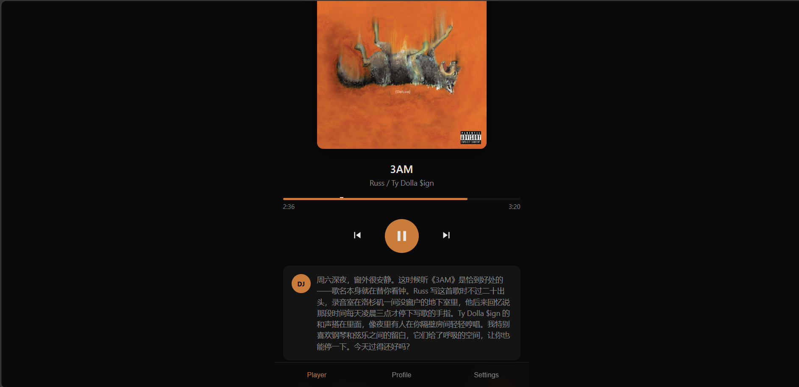
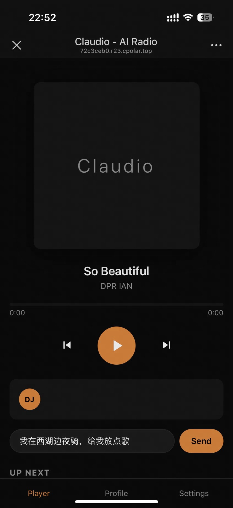
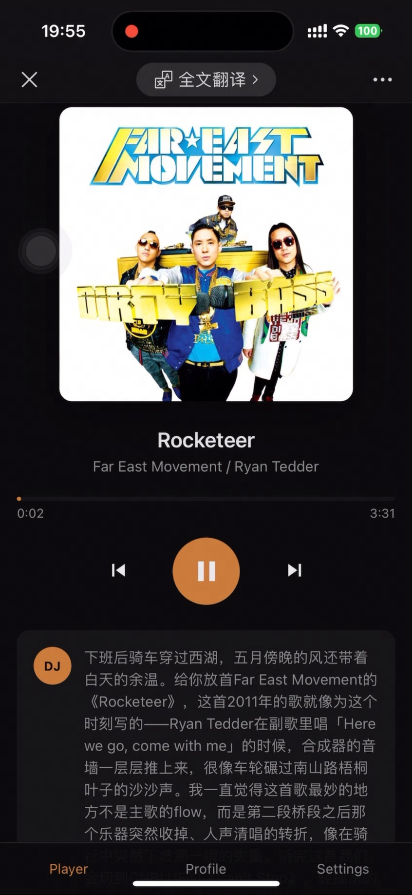

# Claudio · 私人 AI 电台

> 把你的网易云歌单交给一个会讲故事的 AI DJ — 它替你选歌、记得你的口味、还会像深夜电台主播那样跟你聊两句。

[](LICENSE)
[](https://nodejs.org/)

---

## 是什么

Claudio 不是一个普通的播放器。它是一个**有人格的 DJ**：

- 🎙️ **会说话的 DJ** — 放歌前会开口播报，讲歌曲背景、艺术家故事、为什么这首歌适合此刻
- 🎧 **从你的网易云歌单选歌** — 不是随机播放，是根据时间、你在做什么、最近听过什么来挑
- 🧠 **记得你的品味** — 喜欢什么风格、避雷什么、什么时间适合什么音乐，全部可配置
- 💬 **可以对话** — 你说"我在写代码"或"心情不太好"，它会切到合适的歌
- 📱 **PWA，手机也能用** — 加到主屏跟原生 app 体验一样
- 🆓 **可以零成本跑起来** — DeepSeek（极便宜）+ Edge TTS（完全免费）


---

## 效果展示
### 主机端
<p align="center">
  
</p>

### 手机端
<p align="center">
  
  
</p>

---

## 快速上手

### 1. 准备

- Node.js ≥ 18
- 一个 AI 模型 key（**二选一**）：
  - [DeepSeek](https://platform.deepseek.com/)（推荐，约 ¥1 / 百万 tokens）
  - [Anthropic Claude](https://console.anthropic.com/)
- 网易云音乐账号（可选，但建议 — 否则 VIP 歌拿不到）

### 2. 安装

```bash
git clone https://github.com/CYoung0304/Personal-DJ-Claudio.git
cd claudio
npm install
```

### 3. 配置

复制环境变量和用户档案模板：

```bash
cp .env.example .env
cp user/taste.example.md      user/taste.md
cp user/routines.example.md   user/routines.md
cp user/mood-rules.example.md user/mood-rules.md
cp user/playlists.example.json user/playlists.json
```

然后编辑：

- **`.env`** — 填入你的 `DEEPSEEK_API_KEY`（或 `ANTHROPIC_API_KEY`）
- **`user/playlists.json`** — 填入你的网易云歌单 ID（在 APP 里打开歌单 → 分享 → 复制链接，URL 末尾的数字就是 id）
- **`user/taste.md` / `routines.md` / `mood-rules.md`** — 改成你自己的品味和作息

可选：把网易云的 `MUSIC_U` cookie 填到 `NCM_COOKIE`（浏览器登录网易云 → DevTools → Application → Cookies），可以拿到 VIP 和高品质音源。

### 4. 启动

```bash
npm start
```

打开 <http://localhost:8080> — 在手机上访问就是同一个局域网 IP（PWA 可以"添加到主屏"）。

---

## 自定义 DJ 人格

DJ 怎么说话、说什么风格，全在 [`prompts/dj-persona.md`](prompts/dj-persona.md) 里。想要爵士老电台风、想要二次元少女、想要冷面知识分子 —— 改 prompt 即可。

---

## 架构

| 目录 | 作用 |
|---|---|
| `server.js` | HTTP / WebSocket 服务入口 |
| `brain/` | AI 路由、状态、调度、TTS |
| `music/ncm.js` | 网易云 API 封装 |
| `prompts/` | DJ 人格设定 |
| `user/` | 用户的品味、作息、歌单 |
| `public/` | 前端 PWA |

---

## 常见问题

**Q: 一定要联网才能跑吗？**
A: 是。AI、TTS、网易云歌曲都需要联网。

**Q: 部署到云服务器多人用可以吗？**
A: 当前是单用户设计（`user/` 目录全局共享），多用户需要做账号隔离。

**Q: TTS 不出声怎么办？**
A: Edge TTS 偶尔会返回空音频，已经做了一次重试。如果一直失败，检查网络是否能访问 Microsoft Edge 服务。

**Q: 网易云歌曲拿不到 URL？**
A: 多半是 VIP 歌或灰色歌曲。在 `.env` 填入登录后的 `NCM_COOKIE` 试试。

---

## 贡献

欢迎 PR / Issue。如果你做了好玩的 DJ 人格 prompt，发 PR 进 `prompts/` 目录分享给大家。

---

## 致谢

- [NeteaseCloudMusicApi](https://github.com/Binaryify/NeteaseCloudMusicApi) — 网易云 API
- [msedge-tts](https://github.com/Migushthe2nd/MsEdgeTTS) — 免费 TTS 引擎
- [Anthropic Claude](https://www.anthropic.com/) / [DeepSeek](https://www.deepseek.com/) — 大脑
- 感谢大家的喜欢，**如果可以的话麻烦给颗小心心呀❤！**

---

## 免责声明

本项目仅供个人学习和兴趣使用。网易云音乐 API 为社区逆向，请遵守网易云音乐用户协议，**不要用于商业用途、不要部署成对外开放的服务**。所有歌曲版权归网易云音乐及版权方所有。
